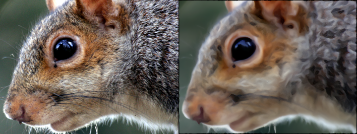
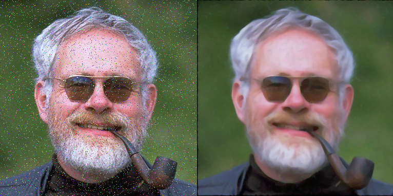
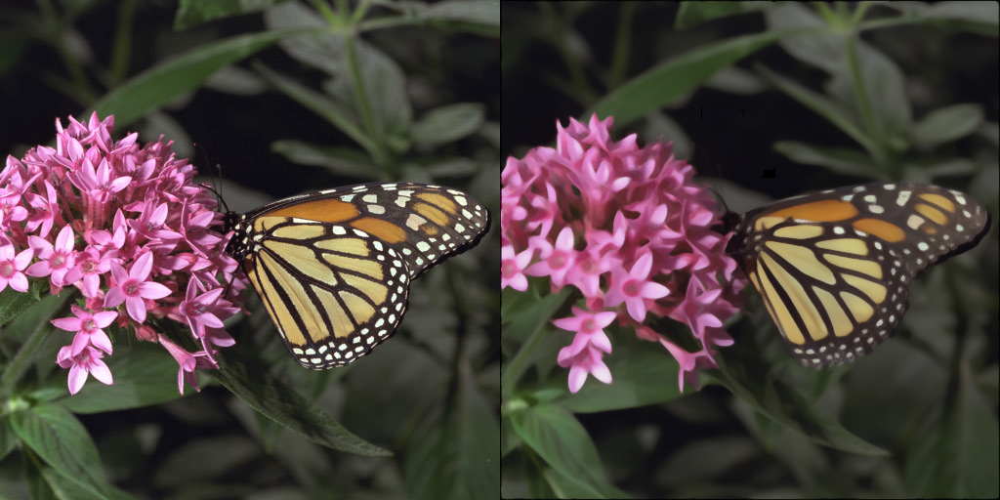
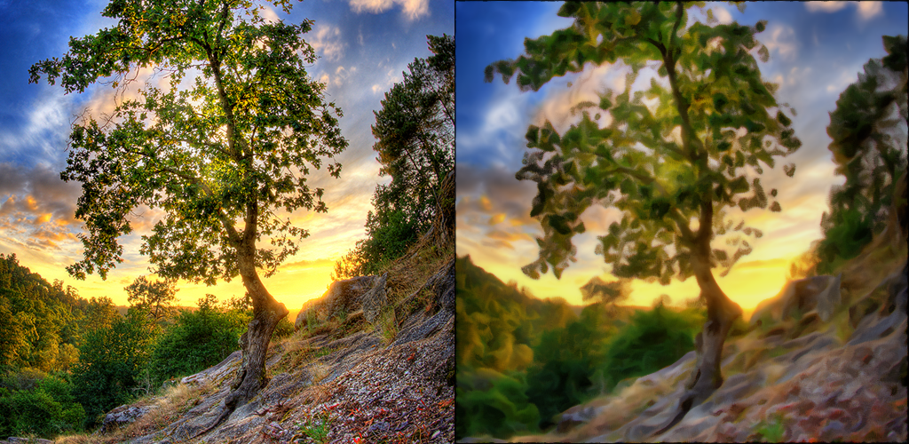

# Anisotropic Kuwahara Filter

[Based on this research paper](https://www.researchgate.net/publication/220507613_Image_and_Video_Abstraction_by_Anisotropic_Kuwahara_Filtering)






Apply the Kuwahara anisotrope filter to a stream of camera or images provided as input to the program.
This project uses the OpenCV library.
There are two versions of the code. One version uses OpenGL to have real-time processing.
CMake is the build system of the project.
## Build from source
```bash
cmake .
make -j8
```

## Usage
Run the shell
```bash
# Version without OpenGL
./src/main [Optional: Path to images]

# Version with OpenGL
./src/main_opengl [Optional: Path to images]
```

# OpenGL version
Use space bar to activate or desactivate the filter.